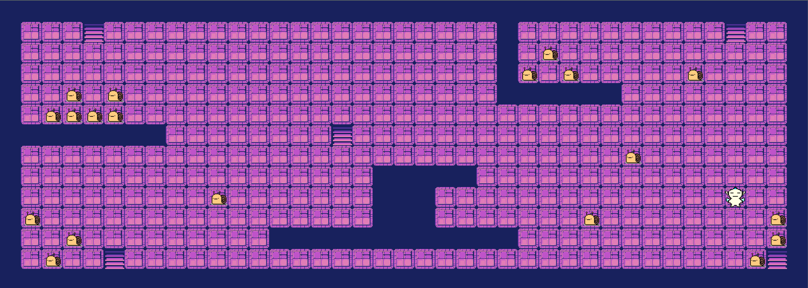

[](https://github.com/nfauconn/so_long/blob/master/README.md)
[](https://github.com/nfauconn/so_long/blob/master/README.fr.md)

*C Programming Language* • *Window Management and Event Handling* • *Working with 2D Graphics* • *Understanding and Implementing Game Mechanics* • *Map Parsing and Validation* • *Memory Management* • *Makefile and Project Organization* 

# So Long

A small 2D game to learn window management, event handling, colors, textures, and so forth.

- Tools used: The school graphical library: the MiniLibX. This library was developed internally and includes basic necessary tools to open a window, create images, and deal with keyboard and mouse events.

| Key | Value |
| --- | --- |
| Program name | `so_long` |
| Language | C |
| Turn in files | `Makefile`, `*.h`, `*.c`, `maps`, `textures` |
| Makefile | `NAME`, `all`, `clean`, `fclean`, `re` |
| Arguments | A map in format `*.ber` |
| External functs. allowed | `open`, `close`, `read`, `write`, `malloc`, `free`, `perror`, `strerror`, `exit`<br>All functions of the math library (`-lm` compiler option, `man man 3 math`)<br>All functions of the MiniLibX<br> |
| Global variables allowed | None |

## Usage

### Requirements for Linux

- MinilibX only support TrueColor visual type (8,15,16,24 or 32 bits depth)
- X11 include files (package `xorg`)
- XShm extension must be present (package `libxext-dev`)
- Utility functions from BSD systems - development files (package `libbsd-dev`)

### How to run

```shell
git clone git@github.com:nfauconn/so_long.git
cd so_long/Project
make
```

```shell
./so_long <map.ber>
```

- The goal is to collect every collectible present on the map then escape choosing the shortest possible route.
- Use the `W`, `A`, `S`, and `D` keys to move the main character.

Maps are located in `maps/`.
You can write your own if you want. The map must have the `.ber` extension. Here are the rules to follow:

- The map has to be constructed with 3 components: walls, collectibles, and free space
- The map can be composed of these 5 characters:
  - `0` for an empty space
  - `1` for a wall
  - `C` for a collectible
  - `E` for a map exit
  - `P` for the player’s starting position.

This map (bigmap.ber):
```
111111111111111111111111111111111111111
1000E000000000000000000010000000000E001
10000000000000000000000010C000000000001
1000000000000000000000001C0C00000C00001
100C0C000000000000000000111111000000001
10CCCC000000000000000000000000000000001
1111111100000000E0000000000000000000001
100000000000000000000000000000C00000001
100000000000000000111110000000000000001
1000000000C0000000111000000000000000001
1C00000000000000001110000000CP0000000C1
100C000000000111111111111000000000000C1
10C00E000000000000000000000000000000CE1
111111111111111111111111111111111111111
```

Will look like this (I chose Puck from Berserk as the main character and some cute snails to collect (๑•͈ᴗ•͈)):


- The map must contain 1 exit, at least 1 collectible, and 1 starting position to be valid.
- If the map can't contain duplicate characters (exit/start).
- The map must be rectangular.
- The map must be closed/surrounded by walls. 
- The character must have a valid path to escape.
